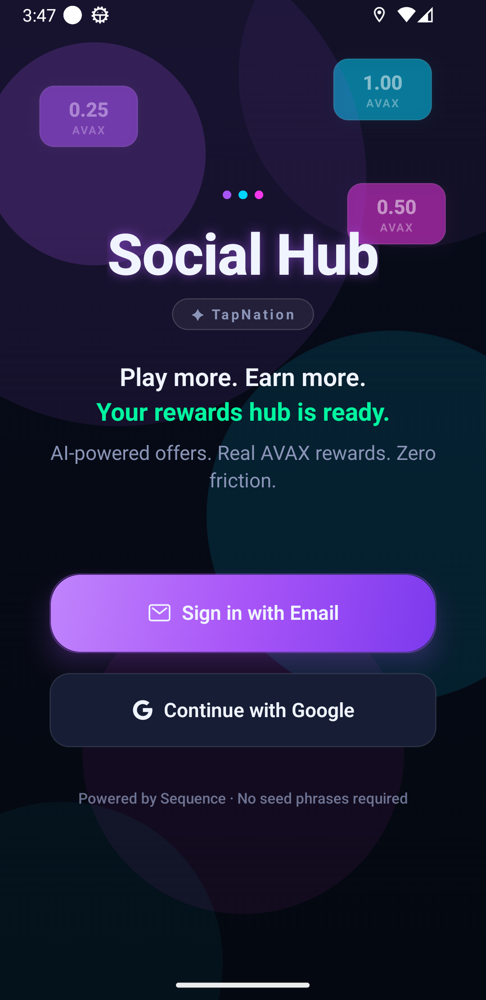
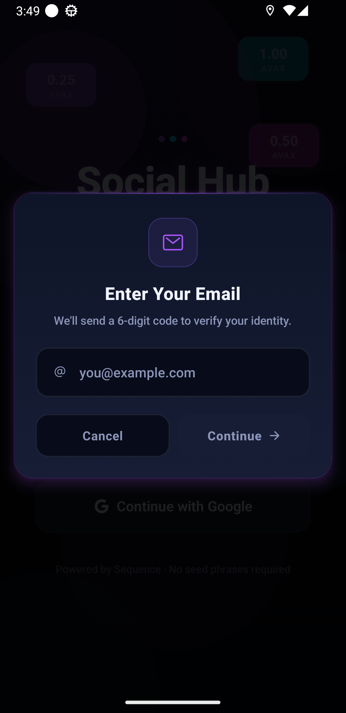
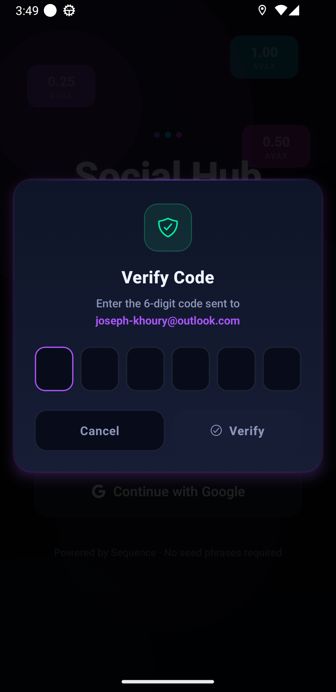
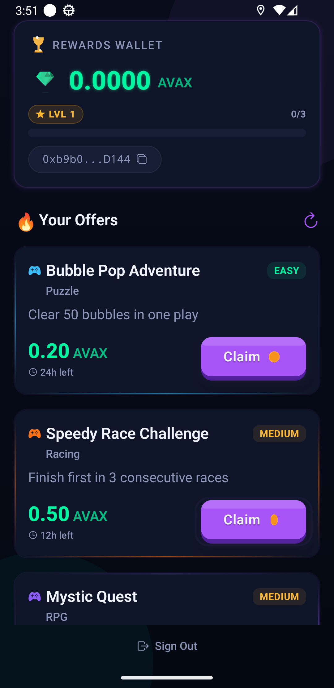
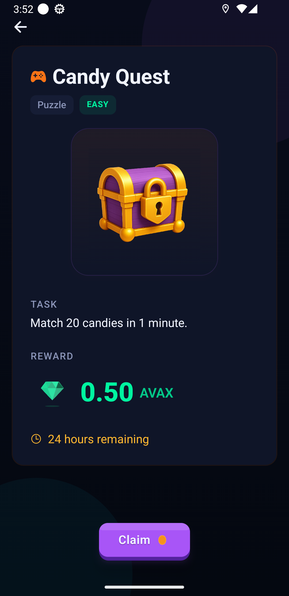
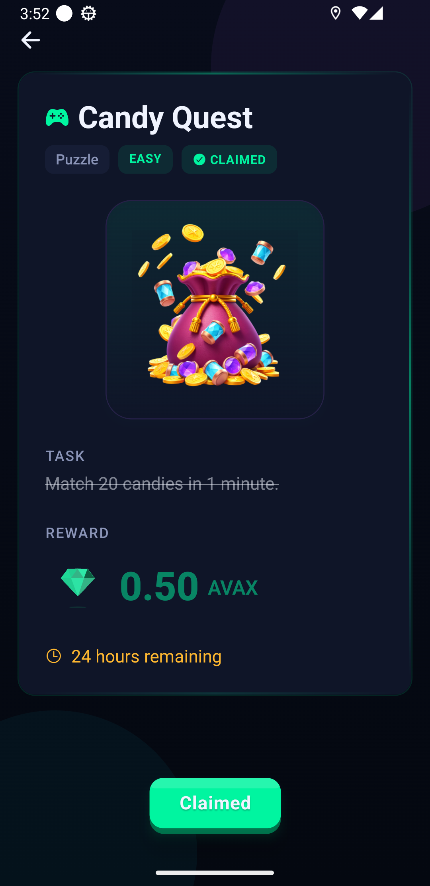

# TapNation Social Hub

A React Native Expo Router proof of concept that bridges casual mobile gamers with Web3 rewards through a frictionless embedded wallet experience and a dynamic AI-powered offerwall.

## Screenshots

<table>
  <tr>
    <td align="center"><br/><sub>Sign-in</sub></td>
    <td align="center"><br/><sub>Email Auth</sub></td>
    <td align="center"><br/><sub>OTP Verify</sub></td>
  </tr>
  <tr>
    <td align="center"><br/><sub>Offerwall</sub></td>
    <td align="center"><br/><sub>Offer Detail</sub></td>
    <td align="center"><br/><sub>Claimed</sub></td>
  </tr>
</table>

## Features

- **Embedded Wallet Auth** -- Sequence WaaS SDK integration with email/guest login. No seed phrases, no wallet setup friction.
- **Wallet Display** -- Public wallet address and native AVAX balance shown after authentication.
- **AI-Streamed Offerwall** -- 3 game offers appear progressively with skeleton placeholders, demonstrating generative UI principles.
- **Claim Flow** -- Satisfying claim interaction with haptic feedback, pending/success/error states, and optimistic balance updates.
- **XP & Level Progression** -- Claiming offers awards XP; a level-up triggers a confetti celebration and sound effect.
- **Celebration Overlays** -- Lottie coin-collect animation and confetti cannon fire on reward events via `CelebrationContext`.
- **Loading Overlay** -- Neon-arc animated spinner provided globally via `LoaderContext`.
- **Game Sounds** -- `expo-audio`-powered coin and win sounds tied to reward events.
- **Animations & Haptics** -- Moti-powered staggered card reveals, spring-based button transitions, and slide-in toast notifications.
- **Mock Fallback** -- All integrations (auth, wallet, offers) gracefully degrade to mock mode when SDK keys are not configured.

## Tech Stack

| Layer      | Technology                                 |
| ---------- | ------------------------------------------ |
| Framework  | React 19 + React Native 0.81 + Expo SDK 54 |
| Routing    | Expo Router v6                             |
| Language   | TypeScript 5.9 (strict)                    |
| State      | Zustand 5 (5 focused stores)               |
| Animation  | React Native Reanimated 4 + Moti 0.30      |
| Lottie     | lottie-react-native                        |
| Audio      | expo-audio                                 |
| Haptics    | expo-haptics                               |
| Web3       | Sequence WaaS SDK + ethers v6              |
| Storage    | expo-secure-store + react-native-keychain  |
| Validation | Zod + React Hook Form                      |

## Architecture

Clean **3-layer architecture** with strict separation:

```
Presentation (app/ routes, src/components/)
     ↓ reads stores via hooks
State (src/store/ -- Zustand)
     ↓ bridged by hooks
Integration (src/services/ -- Sequence, AI stream, claim)
```

**Key rules:**

- Route files stay thin -- layout, navigation, compose hooks/components
- Services return result objects only -- they never mutate stores
- Hooks bridge services and stores
- Stores are small and focused

### Contexts (`src/contexts/`)

Two React context providers are mounted in the root layout and wrap all screens:

| Context              | Purpose                                                                                              |
| -------------------- | ---------------------------------------------------------------------------------------------------- |
| `LoaderContext`      | `showLoader(message?)` / `hideLoader()` — animated neon-arc spinner overlay                          |
| `CelebrationContext` | `triggerCoinCollect()` — Lottie coin animation + sound; `triggerLevelUp()` — confetti cannon + sound |

## Project Structure

```
app/                          # Expo Router routes
  _layout.tsx                 # Root layout: providers, toast, status bar
  index.tsx                   # Bootstrap + redirect
  (auth)/sign-in.tsx          # Sign-in screen (email + guest)
  (app)/index.tsx             # Main offerwall screen
  (app)/offer/[id].tsx        # Offer detail

src/
  components/                 # Reusable UI components
    auth/                     # EmailAuthView
    layout/                   # Screen, GradientBackground
    wallet/                   # WalletHeader, AddressChip, BalanceChip, LevelProgressBar
    offers/                   # OfferCard, OfferList, ClaimButton, OfferSkeletonCard
    feedback/                 # ToastNotification, EmptyState, ErrorState
  contexts/                   # LoaderContext, CelebrationContext
  hooks/                      # useBootstrap, useSequenceAuth, useEmailAuth,
                              # useWallet, useOfferStream, useClaimOffer, useGameSounds
  store/                      # auth, wallet, offers, ui, player stores
  services/                   # Sequence SDK, offer streaming, claim logic
  types/                      # TypeScript interfaces
  theme/                      # Colors, spacing, typography, radius
  config/                     # env.ts — parsed env vars + feature flags
  utils/                      # Formatters, delay, logger
```

## Setup

### Prerequisites

- Node.js 20+
- Expo CLI (`npx expo`)
- iOS Simulator or Android Emulator (or Expo Go)

### Install

```bash
git clone <repo-url>
cd social-hub
npm install
```

### Environment Variables

Copy `.env.example` to `.env` and fill in your keys:

```bash
cp .env.example .env
```

| Variable                                  | Required | Description                             |
| ----------------------------------------- | -------- | --------------------------------------- |
| `EXPO_PUBLIC_SEQUENCE_PROJECT_ACCESS_KEY` | No\*     | Sequence project access key             |
| `EXPO_PUBLIC_SEQUENCE_WAAS_CONFIG_KEY`    | No\*     | Sequence WaaS config key                |
| `EXPO_PUBLIC_GOOGLE_IOS_CLIENT_ID`        | No       | Google OAuth (iOS)                      |
| `EXPO_PUBLIC_GOOGLE_WEB_CLIENT_ID`        | No       | Google OAuth (Web)                      |
| `EXPO_PUBLIC_AVALANCHE_RPC_URL`           | No       | Custom Avalanche RPC endpoint           |
| `EXPO_PUBLIC_OPENAI_API_KEY`              | No       | OpenAI key for real LLM offer streaming |

\*The app works without any keys — all integrations fall back to mock/demo mode.

`src/config/env.ts` exposes parsed config and boolean flags: `isSequenceConfigured`, `isGoogleConfigured`, `isLLMConfigured`, `isAvalancheRpcConfigured`, `isDemoMode`.

### Run

```bash
npx expo start
```

Press `i` for iOS Simulator, `a` for Android Emulator, or scan QR with Expo Go.

## Trade-offs & What's Mocked

This is a POC. Here's what's real vs simulated:

| Feature                | Status                                              |
| ---------------------- | --------------------------------------------------- |
| Sequence auth flow     | Real SDK integration with mock fallback             |
| Email OTP auth         | Real Sequence WaaS flow; mock fallback              |
| Guest sign-in          | Real Sequence WaaS guest flow                       |
| Wallet address display | Real when authenticated via Sequence                |
| AVAX balance           | Fetched from Avalanche RPC; mock fallback           |
| Offer generation       | Mock progressive stream (real LLM optional via env) |
| Claim transaction      | Simulated 1.5s delay with mock tx hash              |
| Balance increment      | Optimistic client-side update                       |
| XP / level system      | Client-side only via `player.store`                 |
| Celebration overlays   | Real Lottie + confetti-cannon animations with audio |
| Session restore        | Real via Sequence SDK persistence layer             |

## What Would Change for Production

- Server-side claim validation and transaction execution
- Backend-managed offer generation with caching and moderation
- Real AVAX token distribution via smart contracts
- Analytics, observability, and error reporting
- Fraud/abuse prevention on claim flow
- Push notifications for offer expiry and new rewards
